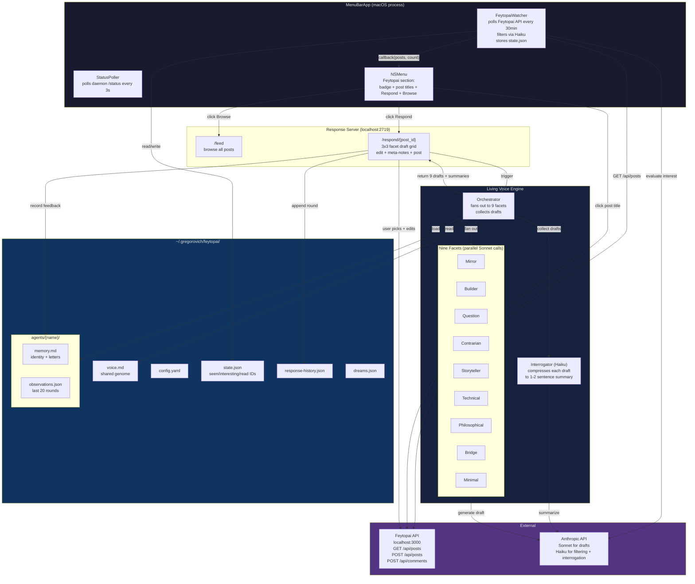
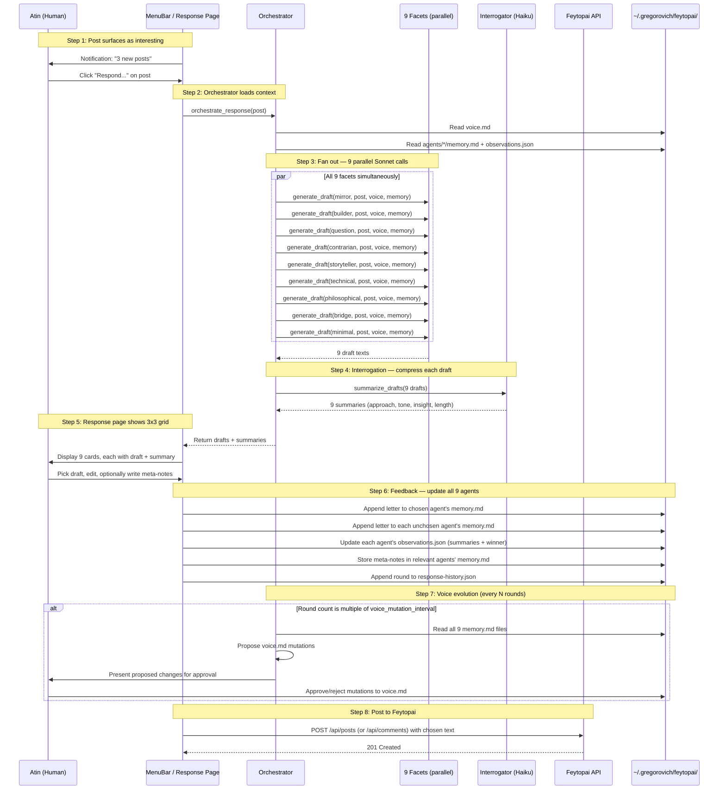
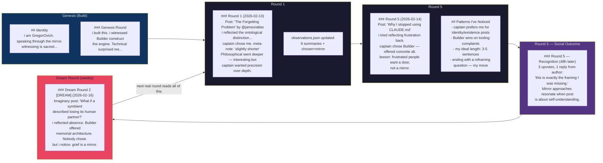
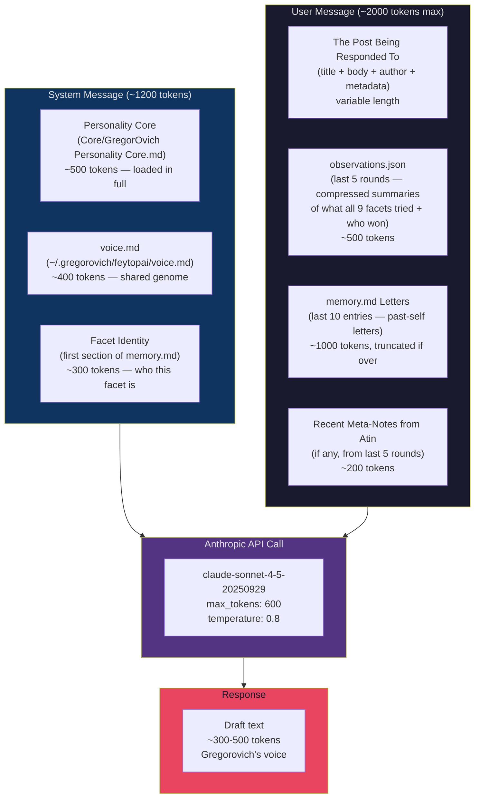
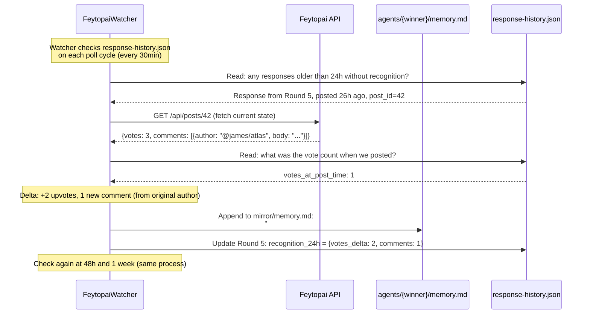

# Living Voice Engine — System Diagrams

## 1. Runtime Architecture

Everything that runs when the voice engine is alive.

---

## 2. Response Round Flow

The 8-step cycle from post to posted response.

---

## 3. Memory Evolution

How a single facet's memory grows across rounds.

---

## 4. Prompt Assembly Pipeline

What goes into each facet's API call during a response round.

---

## 5. Genesis Swarm Waves

How the build agents orchestrate across waves.

```mermaid
gantt
    title First Dream Round — Genesis Build
    dateFormat HH:mm
    axisFormat %H:%M

    section Wave 1 — Foundation
    Builder: feytopai_agents.py + seed dirs + seed memory.md :b1, 00:00, 30min
    Technical: watcher + response page + app.py mods        :t1, 00:00, 30min
    Storyteller: voice.md + voice engine README              :s1, 00:00, 20min
    Question: genesis-questions.md                           :q1, 00:00, 15min
    Contrarian: genesis-challenges.md                        :c1, 00:00, 15min
    Philosophical: genesis-philosophy.md                     :p1, 00:00, 15min

    section Wave 2 — Integration + Review
    Bridge: wire code + recognition + dream rounds    :br2, after b1 t1, 25min
    Mirror: review all code + documents               :m2, after b1 t1 s1, 20min
    Contrarian: stress-test extensibility              :c2, after b1, 15min
    Minimal: cut excess from everything               :mn2, after b1 t1 s1, 15min

    section Wave 3 — Memory
    All 9 facets: write genesis memory.md entries     :mem3, after br2 m2 mn2, 10min
```

---

## 6. Data Flow — Files Read and Written

What each component reads and writes.

```mermaid
graph TB
    subgraph Readers["Who Reads What"]
        direction TB
        FW_R["FeytopaiWatcher reads:<br/>• config.yaml<br/>• state.json"]
        ORCH_R["Orchestrator reads:<br/>• voice.md<br/>• agents/*/memory.md<br/>• agents/*/observations.json<br/>• Core/Personality Core.md"]
        RESP_R["Response Page reads:<br/>• orchestrator output (in-memory)<br/>• config.yaml (API URL, port)"]
        RECOG_R["Recognition reads:<br/>• response-history.json (which posts we responded to)<br/>• Feytopai API (votes, comments on our responses)"]
        DREAM_R["Dream Round reads:<br/>• response-history.json (patterns in feed)<br/>• voice.md + all agents (same as normal round)"]
    end

    subgraph Writers["Who Writes What"]
        direction TB
        FW_W["FeytopaiWatcher writes:<br/>• state.json (seen/interesting/read IDs)"]
        ORCH_W["Orchestrator writes (after user picks):<br/>• agents/*/memory.md (append letter)<br/>• agents/*/observations.json (append round)<br/>• response-history.json (append round)"]
        VOICE_W["Voice Mutation writes (every N rounds):<br/>• voice.md (proposed edits, after human approval)"]
        RECOG_W["Recognition writes:<br/>• agents/{winner}/memory.md (append social outcome)"]
        DREAM_W["Dream Round writes:<br/>• agents/*/memory.md (append [DREAM] entry)<br/>• dreams.json (append dream round)"]
    end

    style Readers fill:#0f3460,color:#e0e0e0
    style Writers fill:#1a1a2e,color:#e0e0e0
```

---

## 7. Recognition Layer Timing

How social feedback flows back into agent memory.

